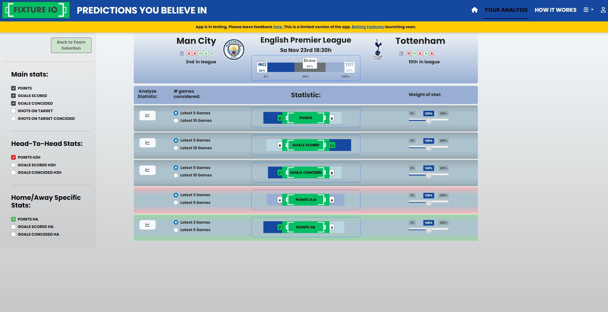

# FixtureIO Predictions App

This Shiny app provides predictions for upcoming football matches, allowing users to explore match probabilities and view "fair odds" based on the predicted outcomes.

The app:
https://sportsbote.shinyapps.io/fixtureio

## Features
- Weekly updated data sourced from the sites noted in "Acknowledgments"
- Select matches and view predicted outcomes
- Calculate "fair odds" based on prediction probabilities

## Installation & Setup
Please reach out if you want to clone the app. See the "Contact" section in this README or the "Authors" section of the app.

## Usage
For a detailed walkthrough and instructions, please refer to the **HOW IT WORKS** section within the app.

## Screenshots

____________________________________________________________________________________

## Permissions
If you would like to use or build upon this app or its code, please reach out for permission and potential collaboration opportunities. Contact information is provided below.

## Contact
For questions, feedback, or permissions, please contact [Rasmus Kaasen](mailto:kaasen1995@hotmail.com).

## Acknowledgments
- Data sourced from [Football-Data.co.uk](https://www.football-data.co.uk) and [Fixturedownload.com](https://www.fixturedownload.com)
